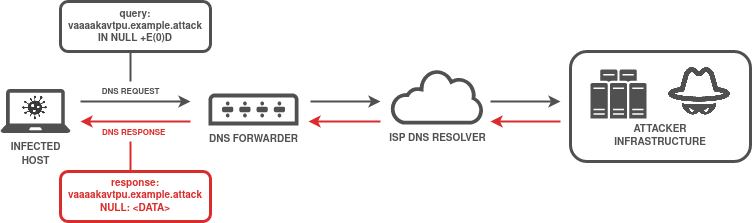
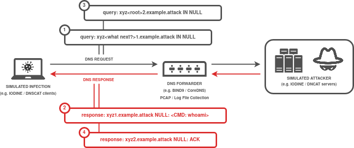
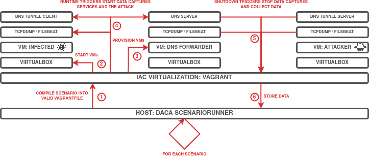

# DNS Tunneling Dataset
[](https://en.wikipedia.org/wiki/MIT_License)
[](https://github.com/Korving-F/DACA)

## Introduction
This repository documents a DNS tunneling scenario written in [DACA](https://github.com/Korving-F/DACA/) configuration language and the generated datasets it creates.
Samples can be used for detection tuning or for educational purposes.

This dataset was created as part of Master thesis work at [TalTech](https://taltech.ee/).

To reproduce the generated datasets, follow these instructions:
```bash
# 1. Install Vagrant and VirtualBox

# 2. Install Vagrant modules
vagrant plugin install vagrant-vbguest
vagrant plugin install vagrant-scp

# 3A Start and stop the VMs of a single dataset, data collection will follow automatically.
cd directory/with/Vagrantfile
vagrant up
vagrant halt

# 3B Alternatively generate and run and recreate all datasets in the scenario.
pip3 install pipenv
git clone git@github.com:Korving-F/DACA.git
cd DACA
pipenv install

python3 daca.py run -d data/ --path /path/to/scenario_file.yaml
```

## MITRE ATT&CK
* [C2 Application Layer Protocol: DNS - T1071.004](https://attack.mitre.org/techniques/T1071/004/)
* [C2 Protocol Tunneling - T1572](https://attack.mitre.org/techniques/T1572/)
* [Exfiltration Over Alternative Protocol - T1048](https://attack.mitre.org/techniques/T1048/)

## Scenario
Used DNS Tunneling software: [IODINE](https://github.com/yarrick/iodine) / [DNS2TCP](https://github.com/alex-sector/dns2tcp) / [DNSCAT](https://github.com/iagox86/dnscat2)

Used DNS Servers: [BIND 9](https://www.isc.org/bind/) / [CoreDNS](https://coredns.io/) / [Dnsmasq](https://thekelleys.org.uk/dnsmasq/doc.html) / [PowerDNS](https://www.powerdns.com/)

## Architecture

> **Fig 1:** DNS Tunnel high-level overview. Encoded/encrypted DNS queries establish a communications channel.
</br>  
</br>  


> **Fig 2:** Overview on how the DNS Tunnels are simulated and allow for C2 / data transfers.
</br>  
</br>  


> **Fig 3:** Runthrough of the VM Creation, Provisioning, Data Generation and Acquisition process using IaC / DevOps tooling.
</br>  


## Detection Rules
* [Sigma](detections/sigma/)
* [SEC](detections/SEC/)
* [Suricata](detections/suricata/)

## Datasets
### File Transfer
#### IODINE
| DNS SERVER | AUTOMATION LEVEL | DNS RECORD TYPE | ENCODING | PASSPHRASE | LINK | DATA LINK | 
| ------------- | ------------- | ------------- | ------------- | ------------- | ------------- | ------------- |
| BIND9 | Fully Automated | CNAME | BASE64 | 0xDEADBEEF | [Scenario files](dns_tunnel_file_transfer/b6cfd110174fb553bb73a5279358c6c1) | [Data files](dns_tunnel_file_transfer/b6cfd110174fb553bb73a5279358c6c1/b6cfd110174fb553bb73a5279358c6c1_full_dataset.tar.gz) | 
| BIND9 | Fully Automated | CNAME | RAW | 0xDEADBEEF | [Scenario files](dns_tunnel_file_transfer/a1c38fbf7990981b871ab08197fd7f05) | [Data files](dns_tunnel_file_transfer/a1c38fbf7990981b871ab08197fd7f05/a1c38fbf7990981b871ab08197fd7f05_full_dataset.tar.gz) | 
| BIND9 | Fully Automated | CNAME | BASE128 | 0xDEADBEEF | [Scenario files](dns_tunnel_file_transfer/3760552cd9b00f3d77da69a99eb92244) | [Data files](dns_tunnel_file_transfer/3760552cd9b00f3d77da69a99eb92244/3760552cd9b00f3d77da69a99eb92244_full_dataset.tar.gz) | 
| BIND9 | Fully Automated | CNAME | BASE32 | 0xDEADBEEF | [Scenario files](dns_tunnel_file_transfer/ddd18462596f938b37d73386b0b79cd2) | [Data files](dns_tunnel_file_transfer/ddd18462596f938b37d73386b0b79cd2/ddd18462596f938b37d73386b0b79cd2_full_dataset.tar.gz) | 
| BIND9 | Fully Automated | MX | BASE64 | 0xDEADBEEF | [Scenario files](dns_tunnel_file_transfer/bcbc96decb05ec093b77a45cd2190db2) | [Data files](dns_tunnel_file_transfer/bcbc96decb05ec093b77a45cd2190db2/bcbc96decb05ec093b77a45cd2190db2_full_dataset.tar.gz) | 
| BIND9 | Fully Automated | MX | BASE128 | 0xDEADBEEF | [Scenario files](dns_tunnel_file_transfer/54879844c9d07bb26fc85fcfb259a32b) | [Data files](dns_tunnel_file_transfer/54879844c9d07bb26fc85fcfb259a32b/54879844c9d07bb26fc85fcfb259a32b_full_dataset.tar.gz) | 
| BIND9 | Fully Automated | MX | RAW | 0xDEADBEEF | [Scenario files](dns_tunnel_file_transfer/4b45b468003dafc9bb3681796d4d5a58) | [Data files](dns_tunnel_file_transfer/4b45b468003dafc9bb3681796d4d5a58/4b45b468003dafc9bb3681796d4d5a58_full_dataset.tar.gz) | 
| BIND9 | Fully Automated | MX | BASE32 | 0xDEADBEEF | [Scenario files](dns_tunnel_file_transfer/a022626474e70afcfa32bb412203b26d) | [Data files](dns_tunnel_file_transfer/a022626474e70afcfa32bb412203b26d/a022626474e70afcfa32bb412203b26d_full_dataset.tar.gz) | 
| BIND9 | Fully Automated | NULL | BASE64 | 0xDEADBEEF | [Scenario files](dns_tunnel_file_transfer/443aade3193a3e68d5aded293e7256d9) | [Data files](dns_tunnel_file_transfer/443aade3193a3e68d5aded293e7256d9/443aade3193a3e68d5aded293e7256d9_full_dataset.tar.gz) | 
| BIND9 | Fully Automated | NULL | BASE32 | 0xDEADBEEF | [Scenario files](dns_tunnel_file_transfer/764c3e9ffbd006fca30854042d303e57) | [Data files](dns_tunnel_file_transfer/764c3e9ffbd006fca30854042d303e57/764c3e9ffbd006fca30854042d303e57_full_dataset.tar.gz) | 
| BIND9 | Fully Automated | NULL | BASE128 | 0xDEADBEEF | [Scenario files](dns_tunnel_file_transfer/0455ce50cb935a6dbfc73182674c9e5f) | [Data files](dns_tunnel_file_transfer/0455ce50cb935a6dbfc73182674c9e5f/0455ce50cb935a6dbfc73182674c9e5f_full_dataset.tar.gz) | 
| BIND9 | Fully Automated | NULL | RAW | 0xDEADBEEF | [Scenario files](dns_tunnel_file_transfer/3fe59915324da1ef9d9ae2fefd735fd9) | [Data files](dns_tunnel_file_transfer/3fe59915324da1ef9d9ae2fefd735fd9/3fe59915324da1ef9d9ae2fefd735fd9_full_dataset.tar.gz) | 
| BIND9 | Fully Automated | PRIVATE | RAW | 0xDEADBEEF | [Scenario files](dns_tunnel_file_transfer/ffd66a98ae4c6591a9884a9de258fd75) | [Data files](dns_tunnel_file_transfer/ffd66a98ae4c6591a9884a9de258fd75/ffd66a98ae4c6591a9884a9de258fd75_full_dataset.tar.gz) | 
| BIND9 | Fully Automated | PRIVATE | BASE32 | 0xDEADBEEF | [Scenario files](dns_tunnel_file_transfer/c65ede91d1f30b627fb70e408bfef5b0) | [Data files](dns_tunnel_file_transfer/c65ede91d1f30b627fb70e408bfef5b0/c65ede91d1f30b627fb70e408bfef5b0_full_dataset.tar.gz) | 
| BIND9 | Fully Automated | PRIVATE | BASE64 | 0xDEADBEEF | [Scenario files](dns_tunnel_file_transfer/a99fe827bdd2c4377e314b1403b1b288) | [Data files](dns_tunnel_file_transfer/a99fe827bdd2c4377e314b1403b1b288/a99fe827bdd2c4377e314b1403b1b288_full_dataset.tar.gz) | 
| BIND9 | Fully Automated | PRIVATE | BASE128 | 0xDEADBEEF | [Scenario files](dns_tunnel_file_transfer/a17ab6a026981083dce589699692ea17) | [Data files](dns_tunnel_file_transfer/a17ab6a026981083dce589699692ea17/a17ab6a026981083dce589699692ea17_full_dataset.tar.gz) | 
| BIND9 | Fully Automated | SRV | BASE32 | 0xDEADBEEF | [Scenario files](dns_tunnel_file_transfer/c94056fa19491662e1b3aed355b61890) | [Data files](dns_tunnel_file_transfer/c94056fa19491662e1b3aed355b61890/c94056fa19491662e1b3aed355b61890_full_dataset.tar.gz) | 
| BIND9 | Fully Automated | SRV | RAW | 0xDEADBEEF | [Scenario files](dns_tunnel_file_transfer/0be4e57778899c15d5ffdf65992219df) | [Data files](dns_tunnel_file_transfer/0be4e57778899c15d5ffdf65992219df/0be4e57778899c15d5ffdf65992219df_full_dataset.tar.gz) | 
| BIND9 | Fully Automated | SRV | BASE64 | 0xDEADBEEF | [Scenario files](dns_tunnel_file_transfer/22d227233839a9c998979247185163fb) | [Data files](dns_tunnel_file_transfer/22d227233839a9c998979247185163fb/22d227233839a9c998979247185163fb_full_dataset.tar.gz) | 
| BIND9 | Fully Automated | SRV | BASE128 | 0xDEADBEEF | [Scenario files](dns_tunnel_file_transfer/de6d5b30160e86c4857bd90471ee931b) | [Data files](dns_tunnel_file_transfer/de6d5b30160e86c4857bd90471ee931b/de6d5b30160e86c4857bd90471ee931b_full_dataset.tar.gz) | 
| BIND9 | Fully Automated | TXT | BASE32 | 0xDEADBEEF | [Scenario files](dns_tunnel_file_transfer/86950175ba9bf6b4aaea5478bbd49ad7) | [Data files](dns_tunnel_file_transfer/86950175ba9bf6b4aaea5478bbd49ad7/86950175ba9bf6b4aaea5478bbd49ad7_full_dataset.tar.gz) | 
| BIND9 | Fully Automated | TXT | BASE64 | 0xDEADBEEF | [Scenario files](dns_tunnel_file_transfer/c6a08caf0d52af99dfd2487f2b48c54a) | [Data files](dns_tunnel_file_transfer/c6a08caf0d52af99dfd2487f2b48c54a/c6a08caf0d52af99dfd2487f2b48c54a_full_dataset.tar.gz) | 
| BIND9 | Fully Automated | TXT | BASE128 | 0xDEADBEEF | [Scenario files](dns_tunnel_file_transfer/7e2db7516bcc8a31c68e8f3ef057c461) | [Data files](dns_tunnel_file_transfer/7e2db7516bcc8a31c68e8f3ef057c461/7e2db7516bcc8a31c68e8f3ef057c461_full_dataset.tar.gz) | 
| BIND9 | Fully Automated | TXT | RAW | 0xDEADBEEF | [Scenario files](dns_tunnel_file_transfer/abbffe6c1c7075d378a42c9a73fba0df) | [Data files](dns_tunnel_file_transfer/abbffe6c1c7075d378a42c9a73fba0df/abbffe6c1c7075d378a42c9a73fba0df_full_dataset.tar.gz) | 
| COREDNS | Fully Automated | CNAME | RAW | 0xDEADBEEF | [Scenario files](dns_tunnel_file_transfer/951158b06a88238b0b0eb21c61202ca3) | [Data files](dns_tunnel_file_transfer/951158b06a88238b0b0eb21c61202ca3/951158b06a88238b0b0eb21c61202ca3_full_dataset.tar.gz) | 
| COREDNS | Fully Automated | CNAME | BASE64 | 0xDEADBEEF | [Scenario files](dns_tunnel_file_transfer/90ebc247563d1d9290d0b3c236de7f4b) | [Data files](dns_tunnel_file_transfer/90ebc247563d1d9290d0b3c236de7f4b/90ebc247563d1d9290d0b3c236de7f4b_full_dataset.tar.gz) | 
| COREDNS | Fully Automated | CNAME | BASE32 | 0xDEADBEEF | [Scenario files](dns_tunnel_file_transfer/183d9ab4491f4e0b4bcd6d76b71941e8) | [Data files](dns_tunnel_file_transfer/183d9ab4491f4e0b4bcd6d76b71941e8/183d9ab4491f4e0b4bcd6d76b71941e8_full_dataset.tar.gz) | 
| COREDNS | Fully Automated | CNAME | BASE128 | 0xDEADBEEF | [Scenario files](dns_tunnel_file_transfer/aa5cbd34f50b2056b0b974bafe0fb84a) | [Data files](dns_tunnel_file_transfer/aa5cbd34f50b2056b0b974bafe0fb84a/aa5cbd34f50b2056b0b974bafe0fb84a_full_dataset.tar.gz) | 
| COREDNS | Fully Automated | MX | BASE128 | 0xDEADBEEF | [Scenario files](dns_tunnel_file_transfer/58ded5e252e8c51aa6695d54295a43b5) | [Data files](dns_tunnel_file_transfer/58ded5e252e8c51aa6695d54295a43b5/58ded5e252e8c51aa6695d54295a43b5_full_dataset.tar.gz) | 
| COREDNS | Fully Automated | MX | BASE32 | 0xDEADBEEF | [Scenario files](dns_tunnel_file_transfer/10d48221fa30e1d509f3b046e8392b80) | [Data files](dns_tunnel_file_transfer/10d48221fa30e1d509f3b046e8392b80/10d48221fa30e1d509f3b046e8392b80_full_dataset.tar.gz) | 
| COREDNS | Fully Automated | MX | RAW | 0xDEADBEEF | [Scenario files](dns_tunnel_file_transfer/48eccc7b2e6a7432bff5d25cec81a59c) | [Data files](dns_tunnel_file_transfer/48eccc7b2e6a7432bff5d25cec81a59c/48eccc7b2e6a7432bff5d25cec81a59c_full_dataset.tar.gz) | 
| COREDNS | Fully Automated | MX | BASE64 | 0xDEADBEEF | [Scenario files](dns_tunnel_file_transfer/b78039daf70a14f80f342c01096de37c) | [Data files](dns_tunnel_file_transfer/b78039daf70a14f80f342c01096de37c/b78039daf70a14f80f342c01096de37c_full_dataset.tar.gz) | 
| COREDNS | Fully Automated | NULL | BASE128 | 0xDEADBEEF | [Scenario files](dns_tunnel_file_transfer/0c86c6687f83bd1a126e20ca5e8efe20) | [Data files](dns_tunnel_file_transfer/0c86c6687f83bd1a126e20ca5e8efe20/0c86c6687f83bd1a126e20ca5e8efe20_full_dataset.tar.gz) | 
| COREDNS | Fully Automated | NULL | BASE32 | 0xDEADBEEF | [Scenario files](dns_tunnel_file_transfer/d2d688818cb1bd2dc39a0ddc47c11371) | [Data files](dns_tunnel_file_transfer/d2d688818cb1bd2dc39a0ddc47c11371/d2d688818cb1bd2dc39a0ddc47c11371_full_dataset.tar.gz) | 
| COREDNS | Fully Automated | NULL | BASE64 | 0xDEADBEEF | [Scenario files](dns_tunnel_file_transfer/37619f58d5affe1e3b846996588f181a) | [Data files](dns_tunnel_file_transfer/37619f58d5affe1e3b846996588f181a/37619f58d5affe1e3b846996588f181a_full_dataset.tar.gz) | 
| COREDNS | Fully Automated | NULL | RAW | 0xDEADBEEF | [Scenario files](dns_tunnel_file_transfer/349fac2879824aaae2e37ea526d77698) | [Data files](dns_tunnel_file_transfer/349fac2879824aaae2e37ea526d77698/349fac2879824aaae2e37ea526d77698_full_dataset.tar.gz) | 
| COREDNS | Fully Automated | PRIVATE | RAW | 0xDEADBEEF | [Scenario files](dns_tunnel_file_transfer/598bd9216a3daad9d5a88120adac64f1) | [Data files](dns_tunnel_file_transfer/598bd9216a3daad9d5a88120adac64f1/598bd9216a3daad9d5a88120adac64f1_full_dataset.tar.gz) | 
| COREDNS | Fully Automated | PRIVATE | BASE64 | 0xDEADBEEF | [Scenario files](dns_tunnel_file_transfer/63b81ea19bee5c99268229e54f87925f) | [Data files](dns_tunnel_file_transfer/63b81ea19bee5c99268229e54f87925f/63b81ea19bee5c99268229e54f87925f_full_dataset.tar.gz) | 
| COREDNS | Fully Automated | PRIVATE | BASE128 | 0xDEADBEEF | [Scenario files](dns_tunnel_file_transfer/5a92d7835c5c0e2d979870c950b112f4) | [Data files](dns_tunnel_file_transfer/5a92d7835c5c0e2d979870c950b112f4/5a92d7835c5c0e2d979870c950b112f4_full_dataset.tar.gz) | 
| COREDNS | Fully Automated | PRIVATE | BASE32 | 0xDEADBEEF | [Scenario files](dns_tunnel_file_transfer/a8729ea1527d5bde93d8450a0e7d73ed) | [Data files](dns_tunnel_file_transfer/a8729ea1527d5bde93d8450a0e7d73ed/a8729ea1527d5bde93d8450a0e7d73ed_full_dataset.tar.gz) | 
| COREDNS | Fully Automated | SRV | RAW | 0xDEADBEEF | [Scenario files](dns_tunnel_file_transfer/997beadcd2a1ac5ac32612d628bb6737) | [Data files](dns_tunnel_file_transfer/997beadcd2a1ac5ac32612d628bb6737/997beadcd2a1ac5ac32612d628bb6737_full_dataset.tar.gz) | 
| COREDNS | Fully Automated | SRV | BASE64 | 0xDEADBEEF | [Scenario files](dns_tunnel_file_transfer/6d59436e2eb763042cac74e864423b0f) | [Data files](dns_tunnel_file_transfer/6d59436e2eb763042cac74e864423b0f/6d59436e2eb763042cac74e864423b0f_full_dataset.tar.gz) | 
| COREDNS | Fully Automated | SRV | BASE128 | 0xDEADBEEF | [Scenario files](dns_tunnel_file_transfer/3e38f10736e5de713f83d962cfa3bc3f) | [Data files](dns_tunnel_file_transfer/3e38f10736e5de713f83d962cfa3bc3f/3e38f10736e5de713f83d962cfa3bc3f_full_dataset.tar.gz) | 
| COREDNS | Fully Automated | SRV | BASE32 | 0xDEADBEEF | [Scenario files](dns_tunnel_file_transfer/f095b3294428ee27dea7df3681343d3a) | [Data files](dns_tunnel_file_transfer/f095b3294428ee27dea7df3681343d3a/f095b3294428ee27dea7df3681343d3a_full_dataset.tar.gz) | 
| COREDNS | Fully Automated | TXT | RAW | 0xDEADBEEF | [Scenario files](dns_tunnel_file_transfer/af390e446296db77550c466c9ebb83b5) | [Data files](dns_tunnel_file_transfer/af390e446296db77550c466c9ebb83b5/af390e446296db77550c466c9ebb83b5_full_dataset.tar.gz) | 
| COREDNS | Fully Automated | TXT | BASE32 | 0xDEADBEEF | [Scenario files](dns_tunnel_file_transfer/dc02049642bce63d48d4d2344cc271f6) | [Data files](dns_tunnel_file_transfer/dc02049642bce63d48d4d2344cc271f6/dc02049642bce63d48d4d2344cc271f6_full_dataset.tar.gz) | 
| COREDNS | Fully Automated | TXT | BASE128 | 0xDEADBEEF | [Scenario files](dns_tunnel_file_transfer/4ab85fc957738024974cd80d6243923a) | [Data files](dns_tunnel_file_transfer/4ab85fc957738024974cd80d6243923a/4ab85fc957738024974cd80d6243923a_full_dataset.tar.gz) | 
| COREDNS | Fully Automated | TXT | BASE64 | 0xDEADBEEF | [Scenario files](dns_tunnel_file_transfer/f1fc55ff66384c71045f20b81200adde) | [Data files](dns_tunnel_file_transfer/f1fc55ff66384c71045f20b81200adde/f1fc55ff66384c71045f20b81200adde_full_dataset.tar.gz) | 
| DNSMASQ | Fully Automated | CNAME | RAW | 0xDEADBEEF | [Scenario files](dns_tunnel_file_transfer/f234dd747f01fde4b8402c39ece4a728) | [Data files](dns_tunnel_file_transfer/f234dd747f01fde4b8402c39ece4a728/f234dd747f01fde4b8402c39ece4a728_full_dataset.tar.gz) | 
| DNSMASQ | Fully Automated | CNAME | BASE64 | 0xDEADBEEF | [Scenario files](dns_tunnel_file_transfer/1cacd366f2f1fc2d48296a7255c7d15d) | [Data files](dns_tunnel_file_transfer/1cacd366f2f1fc2d48296a7255c7d15d/1cacd366f2f1fc2d48296a7255c7d15d_full_dataset.tar.gz) | 
| DNSMASQ | Fully Automated | CNAME | BASE32 | 0xDEADBEEF | [Scenario files](dns_tunnel_file_transfer/03bb49505f204e73deae1f011d2af759) | [Data files](dns_tunnel_file_transfer/03bb49505f204e73deae1f011d2af759/03bb49505f204e73deae1f011d2af759_full_dataset.tar.gz) | 
| DNSMASQ | Fully Automated | CNAME | BASE128 | 0xDEADBEEF | [Scenario files](dns_tunnel_file_transfer/0882c3ac85644b94c860a38161abc69e) | [Data files](dns_tunnel_file_transfer/0882c3ac85644b94c860a38161abc69e/0882c3ac85644b94c860a38161abc69e_full_dataset.tar.gz) | 
| DNSMASQ | Fully Automated | MX | BASE32 | 0xDEADBEEF | [Scenario files](dns_tunnel_file_transfer/fa187324269d1891fce38e7a9cf13a12) | [Data files](dns_tunnel_file_transfer/fa187324269d1891fce38e7a9cf13a12/fa187324269d1891fce38e7a9cf13a12_full_dataset.tar.gz) | 
| DNSMASQ | Fully Automated | MX | RAW | 0xDEADBEEF | [Scenario files](dns_tunnel_file_transfer/3664f077bca95ac684e45b5bbcf7c29b) | [Data files](dns_tunnel_file_transfer/3664f077bca95ac684e45b5bbcf7c29b/3664f077bca95ac684e45b5bbcf7c29b_full_dataset.tar.gz) | 
| DNSMASQ | Fully Automated | MX | BASE128 | 0xDEADBEEF | [Scenario files](dns_tunnel_file_transfer/cc07e44c2cb84fc1fcbdce10bd8b61b9) | [Data files](dns_tunnel_file_transfer/cc07e44c2cb84fc1fcbdce10bd8b61b9/cc07e44c2cb84fc1fcbdce10bd8b61b9_full_dataset.tar.gz) | 
| DNSMASQ | Fully Automated | MX | BASE64 | 0xDEADBEEF | [Scenario files](dns_tunnel_file_transfer/92700245d6c7c10809e5d8b9bc041c8c) | [Data files](dns_tunnel_file_transfer/92700245d6c7c10809e5d8b9bc041c8c/92700245d6c7c10809e5d8b9bc041c8c_full_dataset.tar.gz) | 
| DNSMASQ | Fully Automated | NULL | RAW | 0xDEADBEEF | [Scenario files](dns_tunnel_file_transfer/9afbd9b3a5bff2f26cdf173d29773f54) | [Data files](dns_tunnel_file_transfer/9afbd9b3a5bff2f26cdf173d29773f54/9afbd9b3a5bff2f26cdf173d29773f54_full_dataset.tar.gz) | 
| DNSMASQ | Fully Automated | NULL | BASE32 | 0xDEADBEEF | [Scenario files](dns_tunnel_file_transfer/1cdbe91f7485b6f8392a72d37e4c6501) | [Data files](dns_tunnel_file_transfer/1cdbe91f7485b6f8392a72d37e4c6501/1cdbe91f7485b6f8392a72d37e4c6501_full_dataset.tar.gz) | 
| DNSMASQ | Fully Automated | NULL | BASE128 | 0xDEADBEEF | [Scenario files](dns_tunnel_file_transfer/09e59f0e6846398a437a23b1a357f9f9) | [Data files](dns_tunnel_file_transfer/09e59f0e6846398a437a23b1a357f9f9/09e59f0e6846398a437a23b1a357f9f9_full_dataset.tar.gz) | 
| DNSMASQ | Fully Automated | NULL | BASE64 | 0xDEADBEEF | [Scenario files](dns_tunnel_file_transfer/61a0313b7513dcf30b2629679ba43713) | [Data files](dns_tunnel_file_transfer/61a0313b7513dcf30b2629679ba43713/61a0313b7513dcf30b2629679ba43713_full_dataset.tar.gz) | 
| DNSMASQ | Fully Automated | PRIVATE | BASE32 | 0xDEADBEEF | [Scenario files](dns_tunnel_file_transfer/4af8dcc310fba2b8745e5818968a84b4) | [Data files](dns_tunnel_file_transfer/4af8dcc310fba2b8745e5818968a84b4/4af8dcc310fba2b8745e5818968a84b4_full_dataset.tar.gz) | 
| DNSMASQ | Fully Automated | PRIVATE | BASE64 | 0xDEADBEEF | [Scenario files](dns_tunnel_file_transfer/ebd1b190bce73b7748aff80c29c203a8) | [Data files](dns_tunnel_file_transfer/ebd1b190bce73b7748aff80c29c203a8/ebd1b190bce73b7748aff80c29c203a8_full_dataset.tar.gz) | 
| DNSMASQ | Fully Automated | PRIVATE | RAW | 0xDEADBEEF | [Scenario files](dns_tunnel_file_transfer/225e517be50fcfba1885e98eb023049d) | [Data files](dns_tunnel_file_transfer/225e517be50fcfba1885e98eb023049d/225e517be50fcfba1885e98eb023049d_full_dataset.tar.gz) | 
| DNSMASQ | Fully Automated | PRIVATE | BASE128 | 0xDEADBEEF | [Scenario files](dns_tunnel_file_transfer/389ebab895f207b4632338f1881c7620) | [Data files](dns_tunnel_file_transfer/389ebab895f207b4632338f1881c7620/389ebab895f207b4632338f1881c7620_full_dataset.tar.gz) | 
| DNSMASQ | Fully Automated | SRV | BASE32 | 0xDEADBEEF | [Scenario files](dns_tunnel_file_transfer/211f5f08790e9d51775844b6360e812a) | [Data files](dns_tunnel_file_transfer/211f5f08790e9d51775844b6360e812a/211f5f08790e9d51775844b6360e812a_full_dataset.tar.gz) | 
| DNSMASQ | Fully Automated | SRV | BASE128 | 0xDEADBEEF | [Scenario files](dns_tunnel_file_transfer/fa9a2382cd59a5427af30e882b156635) | [Data files](dns_tunnel_file_transfer/fa9a2382cd59a5427af30e882b156635/fa9a2382cd59a5427af30e882b156635_full_dataset.tar.gz) | 
| DNSMASQ | Fully Automated | SRV | BASE64 | 0xDEADBEEF | [Scenario files](dns_tunnel_file_transfer/aece5bee7b783720ff609f4bd6f849fd) | [Data files](dns_tunnel_file_transfer/aece5bee7b783720ff609f4bd6f849fd/aece5bee7b783720ff609f4bd6f849fd_full_dataset.tar.gz) | 
| DNSMASQ | Fully Automated | SRV | RAW | 0xDEADBEEF | [Scenario files](dns_tunnel_file_transfer/6a05f9eab695eefcc8f64f7e171a3995) | [Data files](dns_tunnel_file_transfer/6a05f9eab695eefcc8f64f7e171a3995/6a05f9eab695eefcc8f64f7e171a3995_full_dataset.tar.gz) | 
| DNSMASQ | Fully Automated | TXT | BASE32 | 0xDEADBEEF | [Scenario files](dns_tunnel_file_transfer/f5077e57457b37061d2b9e765ba6a790) | [Data files](dns_tunnel_file_transfer/f5077e57457b37061d2b9e765ba6a790/f5077e57457b37061d2b9e765ba6a790_full_dataset.tar.gz) | 
| DNSMASQ | Fully Automated | TXT | BASE128 | 0xDEADBEEF | [Scenario files](dns_tunnel_file_transfer/8a2e8949642c69dfe5e6e2e004404e7c) | [Data files](dns_tunnel_file_transfer/8a2e8949642c69dfe5e6e2e004404e7c/8a2e8949642c69dfe5e6e2e004404e7c_full_dataset.tar.gz) | 
| DNSMASQ | Fully Automated | TXT | RAW | 0xDEADBEEF | [Scenario files](dns_tunnel_file_transfer/086b5bcc5a0d0422980bde57f25a2bb1) | [Data files](dns_tunnel_file_transfer/086b5bcc5a0d0422980bde57f25a2bb1/086b5bcc5a0d0422980bde57f25a2bb1_full_dataset.tar.gz) | 
| DNSMASQ | Fully Automated | TXT | BASE64 | 0xDEADBEEF | [Scenario files](dns_tunnel_file_transfer/5e0bf26b32007373b334ad129f074e1c) | [Data files](dns_tunnel_file_transfer/5e0bf26b32007373b334ad129f074e1c/5e0bf26b32007373b334ad129f074e1c_full_dataset.tar.gz) | 
| POWERDNS | Fully Automated | CNAME | RAW | 0xDEADBEEF | [Scenario files](dns_tunnel_file_transfer/a8ce42c7d69a0b38e2f02c78ce9179e9) | [Data files](dns_tunnel_file_transfer/a8ce42c7d69a0b38e2f02c78ce9179e9/a8ce42c7d69a0b38e2f02c78ce9179e9_full_dataset.tar.gz) | 
| POWERDNS | Fully Automated | CNAME | BASE32 | 0xDEADBEEF | [Scenario files](dns_tunnel_file_transfer/8bc7f50c1a9e89ee600df98b35300e7d) | [Data files](dns_tunnel_file_transfer/8bc7f50c1a9e89ee600df98b35300e7d/8bc7f50c1a9e89ee600df98b35300e7d_full_dataset.tar.gz) | 
| POWERDNS | Fully Automated | CNAME | BASE64 | 0xDEADBEEF | [Scenario files](dns_tunnel_file_transfer/15240e299d1030bed511c66cce697acc) | [Data files](dns_tunnel_file_transfer/15240e299d1030bed511c66cce697acc/15240e299d1030bed511c66cce697acc_full_dataset.tar.gz) | 
| POWERDNS | Fully Automated | CNAME | BASE128 | 0xDEADBEEF | [Scenario files](dns_tunnel_file_transfer/2275702da591239c9333856d2d075398) | [Data files](dns_tunnel_file_transfer/2275702da591239c9333856d2d075398/2275702da591239c9333856d2d075398_full_dataset.tar.gz) | 
| POWERDNS | Fully Automated | MX | BASE128 | 0xDEADBEEF | [Scenario files](dns_tunnel_file_transfer/683ac59166b940873376c1192a6c528b) | [Data files](dns_tunnel_file_transfer/683ac59166b940873376c1192a6c528b/683ac59166b940873376c1192a6c528b_full_dataset.tar.gz) | 
| POWERDNS | Fully Automated | MX | BASE32 | 0xDEADBEEF | [Scenario files](dns_tunnel_file_transfer/42d304b0883673aa32089c32190e46f3) | [Data files](dns_tunnel_file_transfer/42d304b0883673aa32089c32190e46f3/42d304b0883673aa32089c32190e46f3_full_dataset.tar.gz) | 
| POWERDNS | Fully Automated | MX | BASE64 | 0xDEADBEEF | [Scenario files](dns_tunnel_file_transfer/b927e64ea0938e4f6da57e252f91464a) | [Data files](dns_tunnel_file_transfer/b927e64ea0938e4f6da57e252f91464a/b927e64ea0938e4f6da57e252f91464a_full_dataset.tar.gz) | 
| POWERDNS | Fully Automated | MX | RAW | 0xDEADBEEF | [Scenario files](dns_tunnel_file_transfer/d97c51a1e22814b0860e7d113d4f9a46) | [Data files](dns_tunnel_file_transfer/d97c51a1e22814b0860e7d113d4f9a46/d97c51a1e22814b0860e7d113d4f9a46_full_dataset.tar.gz) | 
| POWERDNS | Fully Automated | NULL | RAW | 0xDEADBEEF | [Scenario files](dns_tunnel_file_transfer/9f95135b4e4daa6ed03aba7536e1f3b8) | [Data files](dns_tunnel_file_transfer/9f95135b4e4daa6ed03aba7536e1f3b8/9f95135b4e4daa6ed03aba7536e1f3b8_full_dataset.tar.gz) | 
| POWERDNS | Fully Automated | NULL | BASE128 | 0xDEADBEEF | [Scenario files](dns_tunnel_file_transfer/d10621233ab299b404664a8bd4d984c7) | [Data files](dns_tunnel_file_transfer/d10621233ab299b404664a8bd4d984c7/d10621233ab299b404664a8bd4d984c7_full_dataset.tar.gz) | 
| POWERDNS | Fully Automated | NULL | BASE64 | 0xDEADBEEF | [Scenario files](dns_tunnel_file_transfer/7bbaba176a4f227a8d68f7ab89520f50) | [Data files](dns_tunnel_file_transfer/7bbaba176a4f227a8d68f7ab89520f50/7bbaba176a4f227a8d68f7ab89520f50_full_dataset.tar.gz) | 
| POWERDNS | Fully Automated | NULL | BASE32 | 0xDEADBEEF | [Scenario files](dns_tunnel_file_transfer/b5572e832a2e7c2f0b09806ec7b7022d) | [Data files](dns_tunnel_file_transfer/b5572e832a2e7c2f0b09806ec7b7022d/b5572e832a2e7c2f0b09806ec7b7022d_full_dataset.tar.gz) | 
| POWERDNS | Fully Automated | PRIVATE | BASE128 | 0xDEADBEEF | [Scenario files](dns_tunnel_file_transfer/73bfb44c26d1438c91eeb50623487aaf) | [Data files](dns_tunnel_file_transfer/73bfb44c26d1438c91eeb50623487aaf/73bfb44c26d1438c91eeb50623487aaf_full_dataset.tar.gz) | 
| POWERDNS | Fully Automated | PRIVATE | RAW | 0xDEADBEEF | [Scenario files](dns_tunnel_file_transfer/5a5acd1c1b2d080628a07f9b6eedff36) | [Data files](dns_tunnel_file_transfer/5a5acd1c1b2d080628a07f9b6eedff36/5a5acd1c1b2d080628a07f9b6eedff36_full_dataset.tar.gz) | 
| POWERDNS | Fully Automated | PRIVATE | BASE32 | 0xDEADBEEF | [Scenario files](dns_tunnel_file_transfer/60005c35beeabc150d7286becc92988c) | [Data files](dns_tunnel_file_transfer/60005c35beeabc150d7286becc92988c/60005c35beeabc150d7286becc92988c_full_dataset.tar.gz) | 
| POWERDNS | Fully Automated | PRIVATE | BASE64 | 0xDEADBEEF | [Scenario files](dns_tunnel_file_transfer/09b03c539f963624b7169f7a641f0d1e) | [Data files](dns_tunnel_file_transfer/09b03c539f963624b7169f7a641f0d1e/09b03c539f963624b7169f7a641f0d1e_full_dataset.tar.gz) | 
| POWERDNS | Fully Automated | SRV | BASE64 | 0xDEADBEEF | [Scenario files](dns_tunnel_file_transfer/fe12f2ca1faf878899151f08e2248d2c) | [Data files](dns_tunnel_file_transfer/fe12f2ca1faf878899151f08e2248d2c/fe12f2ca1faf878899151f08e2248d2c_full_dataset.tar.gz) | 
| POWERDNS | Fully Automated | SRV | RAW | 0xDEADBEEF | [Scenario files](dns_tunnel_file_transfer/30c78bb0237ae9534749969a94cdeb49) | [Data files](dns_tunnel_file_transfer/30c78bb0237ae9534749969a94cdeb49/30c78bb0237ae9534749969a94cdeb49_full_dataset.tar.gz) | 
| POWERDNS | Fully Automated | SRV | BASE32 | 0xDEADBEEF | [Scenario files](dns_tunnel_file_transfer/18d15f5d3db9a6372631ec1f73b2f214) | [Data files](dns_tunnel_file_transfer/18d15f5d3db9a6372631ec1f73b2f214/18d15f5d3db9a6372631ec1f73b2f214_full_dataset.tar.gz) | 
| POWERDNS | Fully Automated | SRV | BASE128 | 0xDEADBEEF | [Scenario files](dns_tunnel_file_transfer/31e01eef42c418b532131424e074408f) | [Data files](dns_tunnel_file_transfer/31e01eef42c418b532131424e074408f/31e01eef42c418b532131424e074408f_full_dataset.tar.gz) | 
| POWERDNS | Fully Automated | TXT | BASE64 | 0xDEADBEEF | [Scenario files](dns_tunnel_file_transfer/cc1248a9430d9f66829cd442a0a044aa) | [Data files](dns_tunnel_file_transfer/cc1248a9430d9f66829cd442a0a044aa/cc1248a9430d9f66829cd442a0a044aa_full_dataset.tar.gz) | 
| POWERDNS | Fully Automated | TXT | BASE128 | 0xDEADBEEF | [Scenario files](dns_tunnel_file_transfer/b6ca881f97e3d400b88ca41b707c104c) | [Data files](dns_tunnel_file_transfer/b6ca881f97e3d400b88ca41b707c104c/b6ca881f97e3d400b88ca41b707c104c_full_dataset.tar.gz) | 
| POWERDNS | Fully Automated | TXT | RAW | 0xDEADBEEF | [Scenario files](dns_tunnel_file_transfer/0d3ddb38c07f4013dba7ce2225b3472a) | [Data files](dns_tunnel_file_transfer/0d3ddb38c07f4013dba7ce2225b3472a/0d3ddb38c07f4013dba7ce2225b3472a_full_dataset.tar.gz) | 
| POWERDNS | Fully Automated | TXT | BASE32 | 0xDEADBEEF | [Scenario files](dns_tunnel_file_transfer/2aa74ee6fc30ef41a2a99648d4e401f0) | [Data files](dns_tunnel_file_transfer/2aa74ee6fc30ef41a2a99648d4e401f0/2aa74ee6fc30ef41a2a99648d4e401f0_full_dataset.tar.gz) | 


#### DNS2TCP
| DNS SERVER | AUTOMATION LEVEL | DNS RECORD TYPE | COMPRESSION | PASSPHRASE | LINK | DATA LINK | 
| ------------- | ------------- | ------------- | ------------- | ------------- | ------------- | ------------- |
| BIND9 | Fully Automated | KEY | YES | 0xDEADBEEF | [Scenario files](dns_tunnel_file_transfer/d38bd4d0f4519ed3a19169f3b5420fec) | [Data files](dns_tunnel_file_transfer/d38bd4d0f4519ed3a19169f3b5420fec/d38bd4d0f4519ed3a19169f3b5420fec_full_dataset.tar.gz) | 
| BIND9 | Fully Automated | KEY | NO | 0xDEADBEEF | [Scenario files](dns_tunnel_file_transfer/e42ff3f6df0dcf6f67ceff5389b27ac5) | [Data files](dns_tunnel_file_transfer/e42ff3f6df0dcf6f67ceff5389b27ac5/e42ff3f6df0dcf6f67ceff5389b27ac5_full_dataset.tar.gz) | 
| BIND9 | Fully Automated | TXT | YES | 0xDEADBEEF | [Scenario files](dns_tunnel_file_transfer/1859482d263a4a0e80b8930fe956ddfc) | [Data files](dns_tunnel_file_transfer/1859482d263a4a0e80b8930fe956ddfc/1859482d263a4a0e80b8930fe956ddfc_full_dataset.tar.gz) | 
| BIND9 | Fully Automated | TXT | NO | 0xDEADBEEF | [Scenario files](dns_tunnel_file_transfer/78e4e15ea053492cd7543b3e3ad1982d) | [Data files](dns_tunnel_file_transfer/78e4e15ea053492cd7543b3e3ad1982d/78e4e15ea053492cd7543b3e3ad1982d_full_dataset.tar.gz) | 
| COREDNS | Fully Automated | KEY | YES | 0xDEADBEEF | [Scenario files](dns_tunnel_file_transfer/45be1c3502f4f7d6eab06c4b20c3ff4a) | [Data files](dns_tunnel_file_transfer/45be1c3502f4f7d6eab06c4b20c3ff4a/45be1c3502f4f7d6eab06c4b20c3ff4a_full_dataset.tar.gz) | 
| COREDNS | Fully Automated | KEY | NO | 0xDEADBEEF | [Scenario files](dns_tunnel_file_transfer/dba0532816b3c0b3d28d84d26ce5e957) | [Data files](dns_tunnel_file_transfer/dba0532816b3c0b3d28d84d26ce5e957/dba0532816b3c0b3d28d84d26ce5e957_full_dataset.tar.gz) | 
| COREDNS | Fully Automated | TXT | YES | 0xDEADBEEF | [Scenario files](dns_tunnel_file_transfer/0764e849bc26276d2f656413d71e9fef) | [Data files](dns_tunnel_file_transfer/0764e849bc26276d2f656413d71e9fef/0764e849bc26276d2f656413d71e9fef_full_dataset.tar.gz) | 
| COREDNS | Fully Automated | TXT | NO | 0xDEADBEEF | [Scenario files](dns_tunnel_file_transfer/498d16f6c02ca9f864da3e8a4fdf46cf) | [Data files](dns_tunnel_file_transfer/498d16f6c02ca9f864da3e8a4fdf46cf/498d16f6c02ca9f864da3e8a4fdf46cf_full_dataset.tar.gz) | 
| DNSMASQ | Fully Automated | KEY | YES | 0xDEADBEEF | [Scenario files](dns_tunnel_file_transfer/9bc51b58afaf53a9887c1a1c1fda83c4) | [Data files](dns_tunnel_file_transfer/9bc51b58afaf53a9887c1a1c1fda83c4/9bc51b58afaf53a9887c1a1c1fda83c4_full_dataset.tar.gz) | 
| DNSMASQ | Fully Automated | KEY | NO | 0xDEADBEEF | [Scenario files](dns_tunnel_file_transfer/74ca6f3473b225ffe3bb0e2a0266c001) | [Data files](dns_tunnel_file_transfer/74ca6f3473b225ffe3bb0e2a0266c001/74ca6f3473b225ffe3bb0e2a0266c001_full_dataset.tar.gz) | 
| DNSMASQ | Fully Automated | TXT | NO | 0xDEADBEEF | [Scenario files](dns_tunnel_file_transfer/67b710bfbc3799f873115ad207c0cda9) | [Data files](dns_tunnel_file_transfer/67b710bfbc3799f873115ad207c0cda9/67b710bfbc3799f873115ad207c0cda9_full_dataset.tar.gz) | 
| DNSMASQ | Fully Automated | TXT | YES | 0xDEADBEEF | [Scenario files](dns_tunnel_file_transfer/89459fcbc4852e0825c28fb19f87f8de) | [Data files](dns_tunnel_file_transfer/89459fcbc4852e0825c28fb19f87f8de/89459fcbc4852e0825c28fb19f87f8de_full_dataset.tar.gz) | 
| POWERDNS | Fully Automated | KEY | NO | 0xDEADBEEF | [Scenario files](dns_tunnel_file_transfer/fb4336bf7d402dcf5629ca9e17c02d70) | [Data files](dns_tunnel_file_transfer/fb4336bf7d402dcf5629ca9e17c02d70/fb4336bf7d402dcf5629ca9e17c02d70_full_dataset.tar.gz) | 
| POWERDNS | Fully Automated | KEY | YES | 0xDEADBEEF | [Scenario files](dns_tunnel_file_transfer/fc800d962437932da1e41cfeb86dc316) | [Data files](dns_tunnel_file_transfer/fc800d962437932da1e41cfeb86dc316/fc800d962437932da1e41cfeb86dc316_full_dataset.tar.gz) | 
| POWERDNS | Fully Automated | TXT | NO | 0xDEADBEEF | [Scenario files](dns_tunnel_file_transfer/d3be68c13e598d18675cafb11f6ee651) | [Data files](dns_tunnel_file_transfer/d3be68c13e598d18675cafb11f6ee651/d3be68c13e598d18675cafb11f6ee651_full_dataset.tar.gz) | 
| POWERDNS | Fully Automated | TXT | YES | 0xDEADBEEF | [Scenario files](dns_tunnel_file_transfer/c582d0fd2a026976d15daaa854015998) | [Data files](dns_tunnel_file_transfer/c582d0fd2a026976d15daaa854015998/c582d0fd2a026976d15daaa854015998_full_dataset.tar.gz) | 


#### DNSCAT
| DNS SERVER | AUTOMATION LEVEL | LINK | DATA LINK | 
| ------------- | ------------- | ------------- | ------------- |


### C2
None

## License
> DACA is licensed under the [MIT](#) license.  
> Copyright &copy; 2022, Frank Korving
    